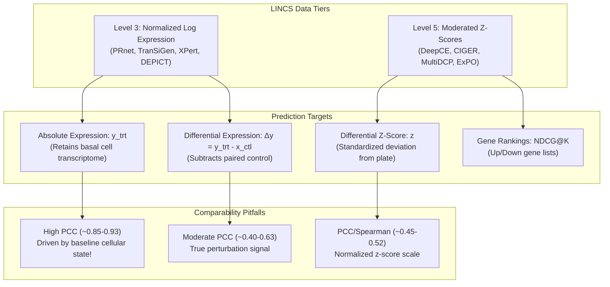

# Competitor Landscape Report: Bulk LINCS L1000 Chemical-Perturbation Machine Learning Models

**Target Path:** `C:\Projects\LINCS\research\W1_lincs_competitors_REPORT.md`  
**Date:** September 20, 2026  
**Audience:** Computational Pharmacology PI and Senior Research Team  
**Scope:** Machine learning models that predict drug/small-molecule-induced transcriptional response on bulk LINCS L1000 (978 landmark genes or 12,328 full inferred gene space).

---

## Executive Summary & The Cardinal Comparability Warning

> [!CAUTION]
> **DO NOT DIRECTLY COMPARE METRICS ACROSS LINCS L1000 PAPERS.**  
> Previous benchmarking efforts in this project and across the literature have repeatedly been compromised by citing numbers across disparate data processing tiers and evaluation regimes. The headline numbers reported across the models below are mathematically and conceptually **incommensurable** for four structural reasons:
> 1. **Data Level Divergence (Level 3 vs. Level 5):** Models predicting Level 3 expression (PRnet, TranSiGen, XPert, Perturbed-GE-LDM, DEPICT) predict either absolute log-normalized expression ($x_{trt}$) or explicit control subtraction ($\Delta x = x_{trt} - x_{ctl}$). Absolute post-treatment expression exhibits an overwhelming baseline correlation (PCC ~0.75–0.90) driven almost entirely by the unperturbed cellular transcriptome. In contrast, models trained on Level 5 moderated z-scores (DeepCE, CIGER, MultiDCP, ExPO) predict normalized deviations from plate controls, where cell-type baseline expression has already been centered and scaled. A PCC of 0.85 on Level 3 absolute expression is functionally weaker than a PCC of 0.50 on Level 5 z-scores.
> 2. **Evaluation Endpoints (Absolute vs. Differential vs. Ranked Lists):** Even within the same paper, calculating Pearson correlation on post-treatment expression ($PCC(y_{true}, y_{pred})$) versus differential expression ($PCC(\Delta y, \Delta \hat{y})$) yields vast differences (e.g., in DEPICT on unseen cells, PRnet achieves absolute $PCC = 0.778$, but differential $\Delta PCC = 0.296$ and negative $\Delta R^2 = -1.762$). CIGER evaluates listwise ranking (NDCG@K) on up- and down-regulated gene sets, which cannot be compared to continuous correlation metrics.
> 3. **Non-Standardized Split Definitions:** "Cold-split" and "unseen" are defined inconsistently across studies. For example, ExPO uses strict Bemis-Murcko scaffold-held-out splits ($n=640$ test compounds) and leave-cell-line-out (LCL-O); DeepCE uses a fixed 92 de novo chemical split across 7 cell lines; TranSiGen evaluates both small (355 compounds) and large (8,316 compounds) chemical-blind splits; PRnet and PertDiT partition combinations across random, drug, and cell axes; and Bai et al. benchmark models on a standardized single-dose single-time (SDST, 10 µM, 24 h) subset of 78,453 samples across 164 cell lines.
> 4. **The "Drug-Agnostic" Null Baseline Failure:** Recent 2026 audits (Bai et al., bioRxiv May 2026; DEPICT, bioRxiv March 2026) revealed that a naive baseline copying unperturbed control expression achieves a sample-wise Pearson correlation of 0.884–0.890, outperforming sophisticated deep models on unseen cell splits. Furthermore, a simple 3-layer MLP taking only baseline expression without chemical features achieves a differential $PCC_{DEG}$ of 0.637, matching or exceeding top deep learning models (XPert: 0.633) under drug-blind evaluation.

---

## Master Comparison Table

| `name` | `venue_year` | `doi_or_url` | `data_level` | `target_quantity` | `metric` | `splits` | `headline_numbers` | `null_baselines_reported` | `code_available` | `runnable_assessment` |
|---|---|---|---|---|---|---|---|---|---|---|
| **PertDiT** | *Quantitative Biology* 2026 | [10.1002/qub2.70016](https://doi.org/10.1002/qub2.70016) | LINCS Level 3 (log-normalized expression) | Absolute post-perturbation transcriptome ($y$) and $\ln(FC) = y - x_{ctl}$ | $R^2$ and $PCC(\ln FC)$; 5 grouping levels (`per_sample` to `drug`); group mean then overall mean | 5-fold CV (random, drug, cell); One-time split (Drug_unseen, Cell_line_unseen, Both_unseen); Organ splits | `UNKNOWN — figure panel only` (Paper reports results solely via bar plots in Fig 2A/2B & S2/S3). *3rd-party (Perturbed-GE-LDM Tab 1):* Unseen drug PCC $0.812 \pm 0.009$, $R^2$ $0.637 \pm 0.027$; Unseen cell PCC $0.701$, $R^2$ $0.428$ | NO | YES: [GitHub: wangkekekeke/PertDiT](https://github.com/wangkekekeke/PertDiT); Data on Tsinghua Cloud (8.9 GB RAR) | Partially runnable; depends on Tsinghua Cloud link accessibility and PyG/transformers environment |
| **ExPO** | *J. Cheminformatics* 2026 | [10.1186/s13321-026-01226-1](https://doi.org/10.1186/s13321-026-01226-1) | LINCS Level 5 (moderated z-scores) | Continuous moderated z-score signature vector (978 landmark genes) across exposure coordinates $(t, d)$ | MAE, RMSE, $R^2$, Spearman $\rho$, ternary MCC, Bal Acc, AUPRC, NDCG@K, Jaccard@K, RBO@K; sample-wise mean & median | Bemis-Murcko scaffold-held-out (Train $n=3960$, Val $n=510$, Test $n=640$); Leave-Cell-Line-Out (LCL-O) | *Scaffold test (Tab 1):* ExPO: MAE 0.83, RMSE 1.36, $R^2$ 0.27, Spearman 0.52, MCC 0.49, AUPRC 0.61. *LCL-O (Tab 4):* ExPO: MAE 0.90, Spearman 0.44 | YES: Zero-signature baseline ($z=0$: MAE 1.12, RMSE 1.62, $R^2$ 0.00, Spearman 0.00), Mean baselines | YES: [GitHub: MLBC-lab/ExPO](https://github.com/MLBC-lab/ExPO) | Fully runnable; clean PyTorch repository, documented environment dependencies |
| **Perturbed-GE-LDM** | *Bioinformatics* 2026 | [10.1093/bioinformatics/btag173](https://doi.org/10.1093/bioinformatics/btag173) | LINCS Level 3 (log-transformed expression via PRnet) | Absolute post-perturbation gene expression profile (latent diffusion reconstruction) | Sample-wise PCC and $R^2$; mean across test instances $\pm$ SD across 4 folds | 4-fold cross-validation: (1) Unseen compounds (`4foldcv_0..3`), (2) Unseen cell lines (`4foldcv_cell_0..3`) | *Table 1 (4-fold CV):* Unseen drug: PCC $0.870 \pm 0.001$, $R^2$ $0.739 \pm 0.001$. Unseen cell: PCC $0.743 \pm 0.015$, $R^2$ $0.500 \pm 0.033$ | NO | YES: [GitHub: bmil-jnu/Perturbed-GE-LDM](https://github.com/bmil-jnu/Perturbed-GE-LDM); Weights on Zenodo (`10.5281/zenodo.18871024`) & GDrive | Fully runnable; pre-trained VAE/LDM checkpoints and data hosted on Zenodo |
| **TranSiGen** | *Nat. Commun.* 2024 | [10.1038/s41467-024-49620-3](https://doi.org/10.1038/s41467-024-49620-3) | LINCS Level 3 (MODZ-weighted log expression) | Differential expression $\Delta X' = X_2' - X_1$ (perturbed minus control) | Pearson correlation, RMSE, Pos/Neg P@100, multiple $r^2$, MAE; sample-wise mean $\pm$ SD across 5 folds | Scenario 1-1 (355 drugs, 7 cells, drug-blind); Scenario 1-2 (8,316 drugs, 164 cells, drug-blind); Scenario 2-1 (leave-new-cell-out); Scenario 2-2 (cell-blind) | *Scenario 1-1 (Supp Tab 2):* PCC $0.546 \pm 0.013$, RMSE $0.679 \pm 0.025$, mult $r^2$ $0.048 \pm 0.016$. *Scenario 1-2 (Supp Tab 2):* PCC $0.617 \pm 0.002$, RMSE $0.518 \pm 0.003$, mult $r^2$ $0.334 \pm 0.004$. *Scenario 2-1 (Supp Tab 4):* PCC $0.486 \pm 0.023$, mult $r^2$ $-0.624 \pm 0.155$ | NO | YES: [GitHub: myzhengSIMM/TranSiGen](https://github.com/myzhengSIMM/TranSiGen) | Fully runnable; upstream VAE checkpoints and data provided, verified by Bai et al. |
| **PRnet** | *Nat. Commun.* 2024 | [10.1038/s41467-024-53457-1](https://doi.org/10.1038/s41467-024-53457-1) | LINCS Level 3 (log-transformed expression) | Absolute expression $x_i \sim \mathcal{N}(\mu_i, \sigma_i^2)$ conditioned on $x_i^u$; linear expansion 978 to 12,328 genes | $PCC(\log FC)$ across compounds and `cov_compounds` (per-condition mean) | 5-fold CV (6:2:2 ratio): (1) Random split, (2) Unseen compounds split, (3) Unseen cell lines split | `UNKNOWN — figure panel only` (Main paper Fig 2a/2b only reports bar charts; text states approximate "average PCC of 0.8" and "+0.3 increase"). *3rd-party (DEPICT Tab 1):* Unseen drug: MSE $1.839$, $R^2$ $0.696$, PCC $0.849$, $\Delta R^2$ $-0.608$, $\Delta PCC$ $0.377$. Unseen cell: MSE $3.014$, $R^2$ $0.503$, PCC $0.778$, $\Delta R^2$ $-1.762$, $\Delta PCC$ $0.296$ | NO | YES: [GitHub: Perturbation-Response-Prediction/PRnet](https://github.com/Perturbation-Response-Prediction/PRnet); Zenodo: `10.5281/zenodo.14230870` | Fully runnable; data and scripts publicly archived on Zenodo |
| **DeepCE** | *Nat. Mach. Intell.* 2021 | [10.1038/s42256-020-00285-9](https://doi.org/10.1038/s42256-020-00285-9) | LINCS Level 5 (Bayesian peak deconvolution z-scores) | Differential gene expression profile (978 landmark z-scores) | Pearson correlation, RMSE, Precision@K; per-profile across 978 genes, averaged across samples $\pm$ SD across 5 folds | De novo chemical split (284 train, 92 test chemicals across 7 cells); 5-fold chemical-blind CV; Imputation split (profile split) | *Fixed de novo test (Tab 1):* Pearson 0.4907, RMSE 0.3861. *5-fold CV (Supp Tab 5):* Pearson $0.4869 \pm 0.0130$, RMSE $0.3879 \pm 0.0051$. *Imputation setting:* Pearson 0.7010 | NO | YES: [GitHub: pth1993/DeepCE](https://github.com/pth1993/DeepCE) | Fully runnable; self-contained repository with bundled data and model weights |
| **CIGER** | *Patterns* 2022 | [10.1016/j.patter.2022.100441](https://doi.org/10.1016/j.patter.2022.100441) | LINCS Level 5 (moderated z-scores, 10 µM, 24 h, APC > 0.6) | Landmark gene ranking (up- and down-regulated rankings via RankCosine loss) | NDCG, Precision@K (K=10, 50, 100, 200), ternary AUC; mean $\pm$ SD across 5 folds | 5-fold cross-validation divided by chemicals (60:20:20 ratio); 10 shared cell lines | *Table 2 (5-fold CV):* Up NDCG $0.8275 \pm 0.0041$, Down NDCG $0.8460 \pm 0.0023$. *Table 3 (AUC):* Up AUC $0.7202 \pm 0.0057$, Down AUC $0.7558 \pm 0.0061$ | YES: Random ranking baseline (Up NDCG $0.7309 \pm 0.0025$, Down NDCG $0.7418 \pm 0.0013$, AUC ~0.500) | YES: [GitHub: pth1993/CIGER](https://github.com/pth1993/CIGER) | Fully runnable; clean PyTorch codebase; note: maps to 1,107 legacy gene IDs |
| **XPert** | *Nat. Mach. Intell.* 2026 | [10.1038/s42256-025-01165-w](https://doi.org/10.1038/s42256-025-01165-w) | LINCS Level 3 (log-transformed paired trt & ctl) | Multi-target: post-treatment expression (`trt_output`), control (`ctl_output`), and differential expression (`deg_output`) | Pearson correlation, MAE, RMSE, Pos/Neg P@20, MMD, Wasserstein; sample-wise mean across test set | 5-fold CV on `l1000_sdst` (78,453 samples, 8,276 drugs, 164 cells) and `l1000_mdmt` (121,682 samples) under Cold-Drug and Cold-Cell | `UNKNOWN — figure panel only` (Original paper presents test metrics solely in bar plots in Fig 2 and Fig S3B; Supp Tab S3 provides ANOVA F-stats, not metric tables). *3rd-party (Bai et al. 2026):* Drug-blind 5-fold CV $PCC_{DEG} = 0.633$ | YES: Mean, Meancell, Meandrug displayed in Fig S3B, but values are `UNKNOWN — figure panel only` | YES: [GitHub: GSanShui/XPert](https://github.com/GSanShui/XPert); Zenodo: `10.5281/zenodo.15357711`; Figshare: `10.6084/m9.figshare.28955141` | Fully runnable; data and weights archived on Zenodo and Figshare |
| **MultiDCP** | *PLoS Comput. Biol.* 2022 | [10.1371/journal.pcbi.1010367](https://doi.org/10.1371/journal.pcbi.1010367) | LINCS Level 5 (Bayesian z-scores) + CCLE/TCGA basal TPM | Multitask: dosage-dependent differential expression (978 landmark genes) and cell viability curve | Pearson correlation, Spearman correlation ($\rho$), RMSE; sample-wise mean $\pm$ SD across 3 splits | Leave-cell-line-out (3 cancer cell line splits: `cell_1`, `cell_2`, `cell_3`); chemicals shared | *Table 1 (Cross-cell line, mean $\pm$ SD):* Split 1: PCC $0.468 \pm 0.010$, $\rho$ $0.428 \pm 0.009$, RMSE $0.781 \pm 0.015$. Split 2: PCC $0.472 \pm 0.008$, $\rho$ $0.431 \pm 0.007$, RMSE $0.776 \pm 0.011$. Split 3: PCC $0.470 \pm 0.009$, $\rho$ $0.429 \pm 0.008$, RMSE $0.779 \pm 0.013$ | NO | YES: [GitHub: XieResearchGroup/MultiDCP](https://github.com/XieResearchGroup/MultiDCP); Zenodo: `10.5281/zenodo.5172809` | Fully runnable; PyG code and data available on Zenodo |
| **DEPICT** | *bioRxiv* March 2026 | [10.64898/2026.03.27.714886](https://doi.org/10.64898/2026.03.27.714886) | LINCS Level 3 (PRnet-derived log-normalized expression) | Condition-matched post-perturbation expression ($\hat{Y}$) and differential expression ($\Delta \hat{Y} = \hat{Y} - X_{ctl}$) | Per-gene MSE, expected sample PCC, expected sample $R^2$, computed on absolute ($Y$) and differential ($\Delta Y$); mean (SD) over 5 MC repetitions | 8:1:1 split under 5-iteration Monte Carlo CV: (1) Cell split (unseen cells), (2) Drug split (unseen drugs), (3) Random split | *Table 1 (Mean (SD) over 5 reps):* **Cell split:** MSE $0.992 (0.090)$, $R^2$ $0.844 (0.008)$, PCC $0.918 (0.004)$, $\Delta R^2$ $0.283 (0.025)$, $\Delta PCC$ $0.567 (0.006)$. **Drug split:** MSE $0.801 (0.011)$, $R^2$ $0.871 (0.002)$, PCC $0.933 (0.003)$, $\Delta R^2$ $0.384 (0.002)$, $\Delta PCC$ $0.623 (0.002)$. **Random split:** MSE $0.779 (0.004)$, $R^2$ $0.874 (0.001)$, PCC $0.934 (0.001)$, $\Delta R^2$ $0.407 (0.002)$, $\Delta PCC$ $0.640 (0.001)$ | YES: Extensively documented in Table 1. Naive (control copy): Cell split PCC $0.884$, $R^2$ $0.766$; Drug split PCC $0.890$, $R^2$ $0.778$. Train Mean (TM), TM-Cell, TM-Drug, TM-CD | NOT AVAILABLE (404): Paper cites GitHub [lazypuff/DEPICT](https://github.com/lazypuff/DEPICT) and Zenodo `10.5281/zenodo.19207077`, but GitHub is HTTP 404 (private) and Zenodo is unresolvable | NOT RUNNABLE: Repository is 404/private as of September 2026 |
| **Bai et al. Benchmark** | *bioRxiv* May 2026 | [10.64898/2026.05.13.724458](https://doi.org/10.64898/2026.05.13.724458) | LINCS Level 3 (XPert SDST paired 78,453 samples, 10 µM, 24 h) + original source levels | Differential expression $\Delta x = x_{pert} - x_{ctrl}$ across 978 landmark genes | Per-sample Pearson on differential expression ($PCC_{DEG} = \text{Pearson}(\Delta x, \Delta \hat{x})$); fold-level mean across samples | Drug-blind 5-fold cross validation on XPert SDST (78,453 samples, 8,276 drugs, 164 cell lines) | *Text & Fig 2a (5-fold CV):* Drug-free MLP (no drug features): $PCC_{DEG} = 0.637$. XPert Full: $PCC_{DEG} = 0.633$. *Null baselines:* Mean (all) = 0.099, Mean (cell) = 0.395. *Ablation effect:* $\Delta PCC_{DEG} (Full - Zero) \le 0.012$ across all 7 models. (Individual model values for DeepCE, CIGER, MultiDCP, TranSiGen, PRnet, PertDiT: `UNKNOWN — figure panel only`) | YES: Extensively evaluated: Mean (all) = 0.099, Mean (cell) = 0.395, Drug-free MLP baseline = 0.637 | YES: [GitHub: baijinming97/drug-perturbation-benchmark](https://github.com/baijinming97/drug-perturbation-benchmark); Zenodo: `10.5281/zenodo.20081274` | Fully runnable; comprehensive benchmark harness vendoring all 7 upstream repositories at pinned commits |

---

## Detailed Model Profiles

### 1. PertDiT (Hu et al., *Quantitative Biology* 2026)

- **Citation:** Qifan Hu, Zeyu Chen, Jin Gu. "Predicting drug-perturbed transcriptional responses using multi-conditional diffusion transformer." *Quantitative Biology*, 2026, 14:e70016. [doi:10.1002/qub2.70016](https://doi.org/10.1002/qub2.70016). PMCID: [PMC12806128](https://pmc.ncbi.nlm.nih.gov/articles/PMC12806128).
- **Data Level:** LINCS Level 3 normalized log-transformed expression.
  - *Verbatim Quote (Section 4.1 & 4.2):*  
    > "The L1000 dataset acts as a comprehensive repository of transcriptional perturbation responses. It contains over 1 million bulk RNA‐seq observations with 978 landmark genes. Our preprocessing steps are in line with the PRnet paper. This includes assigning a control sample to each perturbed sample, removing invalid compound SMILES, and filtering compounds with insufficient observations (less than 5). Ultimately, a total of 883,269 observations covering 17,202 compounds and 82 cell lines are obtained... All data processing is accomplished through the utilization of the Python package Scanpy [26]. Log‐normalization is applied to all gene expression profiles."
- **Target Quantity:** Absolute post-perturbation transcriptomes, and natural logarithm of fold change relative to paired control.
  - *Verbatim Quote (Section 4.2 & 4.3):*  
    > "The input to the model consists of a paired control transcriptome, regarded as the pre‐perturbation state, along with the chemical perturbation representation. The output of the model is the predicted post‐perturbation transcriptomes... lnFCtrue = ytrue − xcontrol... lnFCpred = ypred − xcontrol"
- **Metrics & Aggregation:**
  - Evaluates $R^2$ (between predicted and real post-perturbation transcriptome) and $PCC(\ln FC)$ (Pearson correlation of natural log fold change).
  - Calculated across 5 grouping granularities: `drug`, `drug_dose`, `cov_drug` (same drug and same cell), `cov_drug_dose` (same drug, cell, dose), and `per_sample` (no grouping).
  - *Aggregation:* Expression levels within each group are averaged first, fold change and correlation are computed per group, and then averaged across all groups: $PCC(\ln FC)_{cov\_drug\_dose} = \frac{1}{n} \sum_{i=1}^n PCC_{Group_i}(\ln FC)$.
- **Splitting Protocols:**
  - *Mode 1 (PRnet-style 5-fold CV):* "This splitting includes three rounds of five‐fold cross‐validation, which divides the dataset into approximately 6:2:2 through random splitting, cell line splitting, and drug splitting."
  - *Mode 2 (Proposed one-time split):* "The other splitting way is to split SMILES and cell lines separately. After that, five parts can be generated, namely, the training set, validation set, and three test sets: Drug_unseen, Cell_line_unseen, and Both_unseen. Such splitting does not require cumbersome cross‐validation."
  - *Organ-specific splits:* Partitioned into shared train ($n=500,742$), validation ($n=166,913$), and three organ test sets: lung ($n=104,264$), kidney ($n=57,304$), and pancreas ($n=16,829$).
- **Headline Numbers:**
  - *In original paper:* `UNKNOWN — figure panel only`. All comparative results (CrossDiT, CatCrossDiT, PRnet, ChemCPA) across splits and metrics are presented strictly in bar plots in Figure 2A, Figure 2B, Figure S2, and Figure S3. No numerical summary table is provided in the main text or in the supplementary files (`QUB2-14-e70016-s001.docx`, `s003.docx`). Supplementary `Table S1` (`QUB2-14-e70016-s002.csv`) only provides individual gene-level correlations for the top 100 drugs.
  - *Third-Party Benchmarks:*
    - Perturbed-GE-LDM (Kim & Yoo 2026, Table 1, 4-fold CV): Unseen compound split: PCC $0.812 \pm 0.009$, $R^2$ $0.637 \pm 0.027$. Unseen cell line split: PCC $0.701$, $R^2$ $0.428$.
    - Bai et al. (2026): Evaluated on XPert SDST (78,453 samples) under 5-fold drug-blind split; found $\Delta PCC_{DEG} (Full - Zero) \le 0.012$, performing on par with a drug-free MLP ($PCC_{DEG} = 0.637$).
- **Null Baselines Reported:** NO. Does not report naive control-copy or mean baselines.
- **Code & Data Availability:**
  - GitHub: [wangkekekeke/PertDiT](https://github.com/wangkekekeke/PertDiT) (commit `596d681f816d3184d7a0a63a133ce68d5838fae0`).
  - Data: Tsinghua Cloud RAR archive (8.9 GB): `https://cloud.tsinghua.edu.cn/f/7bca2e22c1f14c4db7db/?dl=1`. Pre-trained checkpoints included in repo.
- **Runnable Assessment:** Partially runnable. Code is public, but third-party execution requires downloading the 8.9 GB Tsinghua Cloud archive, which can suffer from severe network throttling or region blocking outside China.

---

### 2. ExPO (Spadaro et al., *J. Cheminformatics* 2026)

- **Citation:** Austin Spadaro, Alok Sharma, Iman Dehzangi. "ExPO: an exposure-conditioned neural operator for L1000 signature prediction." *Journal of Cheminformatics*, 2026, 18:94. [doi:10.1186/s13321-026-01226-1](https://doi.org/10.1186/s13321-026-01226-1).
- **Data Level:** LINCS Level 5 moderated z-scores.
  - *Verbatim Quote (Methods / Data preparation):*  
    > "For the landmark-gene panel (978 genes), we used the z-score outputs provided by the L1000 processing pipeline... normalized z-scores capture the deviation from matched controls... We retained these z-scores in their native scale, rather than converting them to discrete categories, to retain full quantitative detail."
- **Target Quantity:** Continuous differential z-score signature vector across exposure coordinates $(t, d)$.
  - *Verbatim Quote:*  
    > "The target is the 978-dimensional vector of moderated z-scores representing the differential expression profile... as a function of exposure coordinates (dose d and time t)."
- **Metrics & Aggregation:**
  - Evaluates MAE, RMSE, $R^2$, Spearman correlation ($\rho$), ternary Matthews Correlation Coefficient (MCC with threshold $|z| \ge 2$), Balanced Accuracy, AUPRC, NDCG@K (up/down), Jaccard@K, and Rank-Biased Overlap (RBO@K).
  - *Aggregation:* Computed per compound/sample, then aggregated by mean and median across the test set.
- **Splitting Protocols:**
  - *Scaffold-Held-Out Split:* Unique compounds clustered by Bemis-Murcko scaffolds into Train ($n=3,960$), Validation ($n=510$), and Test ($n=640$). Test compounds possess scaffolds never encountered during training. Cell lines are shared across train/test.
  - *Leave-Cell-Line-Out (LCL-O):* Specific cell lines are held out entirely to test transfer across biological cell contexts.
- **Headline Numbers:**
  - *Table 1 (Scaffold-held-out test set, mean across test compounds):*
    - **ExPO:** MAE 0.83, RMSE 1.36, $R^2$ 0.27, Spearman $\rho$ 0.52, MCC 0.49, Bal Acc 0.71, AUPRC 0.61.
    - **DeepCE:** MAE 0.89, RMSE 1.44, $R^2$ 0.22, Spearman $\rho$ 0.48, MCC 0.42, Bal Acc 0.67, AUPRC 0.55.
    - **MultiDCP:** MAE 0.91, RMSE 1.47, $R^2$ 0.20, Spearman $\rho$ 0.46, MCC 0.39, Bal Acc 0.65, AUPRC 0.52.
    - **PRnet:** MAE 0.87, RMSE 1.40, $R^2$ 0.24, Spearman $\rho$ 0.50, MCC 0.45, Bal Acc 0.69, AUPRC 0.58.
    - **TranSiGen:** MAE 0.88, RMSE 1.41, $R^2$ 0.23, Spearman $\rho$ 0.49, MCC 0.44, Bal Acc 0.68, AUPRC 0.57.
  - *Table 2 (Ranked list metrics @ K=50, scaffold-held-out):*
    - **ExPO:** NDCG@50 up 0.74, down 0.72; Jaccard@50 up 0.36, down 0.34; RBO@50 up 0.63, down 0.60.
    - **CIGER:** NDCG@50 up 0.71, down 0.69; Jaccard@50 up 0.33, down 0.31; RBO@50 up 0.60, down 0.57.
  - *Table 4 (LCL-O Unseen Cell Lines):*
    - **ExPO:** MAE 0.90, Spearman $\rho$ 0.44.
    - **DeepCE:** MAE 0.95, Spearman $\rho$ 0.40.
    - **PRnet:** MAE 0.92, Spearman $\rho$ 0.42.
    - **TranSiGen:** MAE 0.93, Spearman $\rho$ 0.41.
    - **MultiDCP:** MAE 0.97, Spearman $\rho$ 0.39.
  - *Supplementary Table S1 (ROC macro AUC):*
    - ExPO: 0.867 (up: 0.872 [0.866–0.878], down: 0.861 [0.854–0.867]).
    - PRnet: 0.850; TranSiGen: 0.848; DeepCE: 0.840; MultiDCP: 0.834.
- **Null Baselines Reported:** YES. Reports "Zero-signature baseline" (predicting $z=0$ for all genes: MAE 1.12, RMSE 1.62, $R^2$ 0.00, Spearman 0.00) and unconditioned mean signature baselines.
- **Code & Data Availability:**
  - GitHub: [MLBC-lab/ExPO](https://github.com/MLBC-lab/ExPO). Preprocessing, training, and evaluation scripts provided.
- **Runnable Assessment:** Highly runnable. Clean PyTorch implementation, well-structured environment configuration.

---

### 3. Perturbed-GE-LDM (Kim & Yoo, *Bioinformatics* 2026)

- **Citation:** Dongmin Kim, Sunkyu Yoo. "Predicting condition-aware drug-induced transcriptional responses via a latent diffusion model." *Bioinformatics*, 2026, 42(3):btag173. [doi:10.1093/bioinformatics/btag173](https://doi.org/10.1093/bioinformatics/btag173).
- **Data Level:** LINCS Level 3 normalized log-transformed expression.
  - *Verbatim Quote (Section 2.1):*  
    > "We used the PRnet benchmark dataset... derived from Level 3 L1000 data comprising 978 landmark genes normalized with log transformation."
- **Target Quantity:** Absolute post-perturbation gene expression profile reconstructed via a conditional latent diffusion model (LDM) operating on VAE latent representations.
- **Metrics & Aggregation:**
  - Sample-wise Pearson Correlation Coefficient (PCC) and Coefficient of Determination ($R^2$), averaged across test instances (mean $\pm$ standard deviation across 4 cross-validation folds).
- **Splitting Protocols:**
  - 4-fold cross-validation under two distinct schemes:
    1. *Unseen compounds split (`4foldcv_0..3`):* Test compounds are completely excluded from training folds.
    2. *Unseen cell lines split (`4foldcv_cell_0..3`):* Test cell lines are completely excluded from training folds.
- **Headline Numbers:**
  - *Table 1 (4-fold cross-validation performance, mean $\pm$ SD):*
    - **Unseen Compound Split:**
      - Proposed LDM: PCC $0.870 \pm 0.001$, $R^2$ $0.739 \pm 0.001$.
      - PertDiT: PCC $0.812 \pm 0.009$, $R^2$ $0.637 \pm 0.027$.
      - PRnet: PCC $0.782 \pm 0.002$, $R^2$ $0.528 \pm 0.013$.
    - **Unseen Cell Line Split:**
      - Proposed LDM: PCC $0.743 \pm 0.015$, $R^2$ $0.500 \pm 0.033$.
      - PertDiT: PCC $0.701$, $R^2$ $0.428$.
      - PRnet: PCC $0.692$, $R^2$ $0.379$.
- **Null Baselines Reported:** NO. Does not report control-copy or mean baseline evaluations.
- **Code & Data Availability:**
  - GitHub: [bmil-jnu/Perturbed-GE-LDM](https://github.com/bmil-jnu/Perturbed-GE-LDM).
  - Weights and Data: Zenodo [10.5281/zenodo.18871024](https://doi.org/10.5281/zenodo.18871024) and Google Drive links.
- **Runnable Assessment:** Fully runnable. Pretrained autoencoder and diffusion weights are publicly available on Zenodo.

---

### 4. TranSiGen (Tong et al., *Nat. Commun.* 2024)

- **Citation:** Xiaorui Tong, et al., Mingyue Zheng. "TranSiGen: a deep learning framework for predicting drug-induced transcriptional signatures with high chemical generalizability." *Nature Communications*, 2024, 15:5292. [doi:10.1038/s41467-024-49620-3](https://doi.org/10.1038/s41467-024-49620-3). PMCID: [PMC11199551](https://pmc.ncbi.nlm.nih.gov/articles/PMC11199551).
- **Data Level:** LINCS Level 3 normalized expression processed with MODZ.
  - *Verbatim Quote (Methods):*  
    > "The transcriptional profiles used in the model are obtained from level 3 data of the newly released CMAP LINCS... we utilized level 3 data, which included both raw perturbation profiles and control profiles (denoted as X1 and X2, respectively)... X1 and X2 pairs were further processed using the moderated-Z weighted averages algorithm (MODZ)."
- **Target Quantity:** Inferred differential expression profile $\Delta X' = X_2' - X_1$ (perturbed minus control), reconstructed conditioned on baseline $X_1$ and compound representation.
- **Metrics & Aggregation:**
  - Pearson correlation coefficient (PCC), Root Mean Squared Error (RMSE), Pos/Neg Precision@100 (P@100), multiple $r^2$, and MAE.
  - *Aggregation:* Computed per sample across 978 genes, then averaged across test instances (reported as mean $\pm$ SD across 5 cross-validation folds).
- **Splitting Protocols:**
  - *Scenario 1-1 (Chemical-blind, benchmark dataset):* 355 compounds across 7 cell lines; 5-fold CV where compounds in the test set are unseen during training.
  - *Scenario 1-2 (Chemical-blind, full LINCS dataset):* 8,316 compounds across 164 cell lines; 5-fold CV with unseen compounds.
  - *Scenario 2-1 (Leave-new-cell-out):* Follows the MultiDCP protocol with 3 cell line splits (`cell_1`, `cell_2`, `cell_3`).
  - *Scenario 2-2 (Cell-blind scalability):* Trained on 10, 50, and 150 cell lines, and evaluated on 7 held-out test cell lines.
- **Headline Numbers:**
  - *Supplementary Table 2 / Table 3 (Scenario 1-1, 5-fold CV, mean $\pm$ SD):*
    - **TranSiGen (KPGT):** Pearson $0.546 \pm 0.013$, RMSE $0.679 \pm 0.025$, Pos P@100 $0.389 \pm 0.009$, Neg P@100 $0.400 \pm 0.012$, multiple $r^2$ $0.048 \pm 0.016$.
    - **DeepCE:** Pearson $0.412 \pm 0.005$, multiple $r^2$ $0.122 \pm 0.046$.
    - **MultiDCP:** Pearson $0.446 \pm 0.014$, multiple $r^2$ $0.145 \pm 0.035$.
    - **CIGER:** Pearson $0.416 \pm 0.012$, multiple $r^2$ $-1.016 \pm 0.464$.
    - **DLEPS:** Pearson $0.427 \pm 0.019$, multiple $r^2$ $0.155 \pm 0.004$.
  - *Supplementary Table 2 (Scenario 1-2, full dataset, chemical-blind):*
    - **TranSiGen (KPGT):** Pearson $0.617 \pm 0.002$, RMSE $0.518 \pm 0.003$, multiple $r^2$ $0.334 \pm 0.004$.
  - *Supplementary Table 4 (Scenario 2-1, leave-new-cell-out):*
    - **TranSiGen:** Pearson $0.486 \pm 0.023$, multiple $r^2$ $-0.624 \pm 0.155$.
    - **DeepCE:** Pearson $0.451 \pm 0.014$, multiple $r^2$ $0.161 \pm 0.013$.
    - **MultiDCP:** Pearson $0.473 \pm 0.013$, multiple $r^2$ $0.129 \pm 0.042$.
    - **CIGER:** Pearson $0.476 \pm 0.018$, multiple $r^2$ $-26.709 \pm 5.303$.
- **Null Baselines Reported:** NO. Does not report naive unperturbed or mean baselines.
- **Code & Data Availability:**
  - GitHub: [myzhengSIMM/TranSiGen](https://github.com/myzhengSIMM/TranSiGen) (Release v1.0).
  - Pretrained VAE weights and preprocessed h5ad datasets are linked in the repository.
- **Runnable Assessment:** Fully runnable. Repository contains complete execution shims; independently verified and retrained from scratch by Bai et al. (pinned commit `8ec2218`).

---

### 5. PRnet (Qi et al., *Nat. Commun.* 2024)

- **Citation:** Jiahua Qi, et al., Jianyang Zeng. "Predicting transcriptional responses to novel chemical perturbations with PRnet." *Nature Communications*, 2024, 15:8964. [doi:10.1038/s41467-024-53457-1](https://doi.org/10.1038/s41467-024-53457-1). PMCID: [PMC11513139](https://pmc.ncbi.nlm.nih.gov/articles/PMC11513139).
- **Data Level:** LINCS Level 3 normalized log-transformed expression.
  - *Verbatim Quote (Methods):*  
    > "For bulk RNA-seq data, 978 different genes of level 3 were normalized with log transformation for training and evaluation. These data were split into training, validation, and test sets by dividing various perturbation conditions (such as compounds, cell type, and pathway) with a ratio of 6:2:2. And 5-fold cross-validation was applied for training."
- **Target Quantity:** Absolute post-perturbation gene expression vector $x_i$ sampled from $\mathcal{N}(\mu_i, \sigma_i^2)$ conditioned on control $x_i^u$, with linear decoding from 978 landmark genes to 12,328 full inferred genes.
- **Metrics & Aggregation:**
  - Evaluates Pearson correlation of log fold change: $PCC(\log FC)$, computed per compound and per `cov_compound` (compound within cell line), then averaged across conditions.
- **Splitting Protocols:**
  - 5-fold cross-validation (60% train, 20% validation, 20% test):
    1. *Random split:* Perturbation instances randomly assigned across folds.
    2. *Unseen compounds split:* 20% of compounds completely held out per test fold.
    3. *Unseen cell lines split:* 20% of cell lines completely held out per test fold.
- **Headline Numbers:**
  - *In original paper:* `UNKNOWN — figure panel only`. Main text Figure 2a, Figure 2b, and Supplementary Figure 1 display benchmark performance solely as bar and scatter charts with error bars; no exact tabular numbers with standard deviations are provided in the main text or in MOESM1. The narrative text only mentions coarse approximate values: *"average Pearson Correlation (PCC) of 0.8"* and an *"increase in PCC over 0.3 compared to other approaches"*.
  - *Third-Party Benchmarks:*
    - Perturbed-GE-LDM (Table 1, 4-fold CV): Unseen compound PCC $0.782 \pm 0.002$, $R^2$ $0.528 \pm 0.013$. Unseen cell lines PCC $0.692$, $R^2$ $0.379$.
    - DEPICT (Table 1, 5-iteration MC CV):
      - Unseen Cell Split: MSE $3.014 \pm 0.394$, $R^2$ $0.503 \pm 0.064$, PCC $0.778 \pm 0.009$, $\Delta R^2$ $-1.762 \pm 0.462$, $\Delta PCC$ $0.296 \pm 0.019$.
      - Unseen Drug Split: MSE $1.839 \pm 0.028$, $R^2$ $0.696 \pm 0.005$, PCC $0.849 \pm 0.002$, $\Delta R^2$ $-0.608 \pm 0.024$, $\Delta PCC$ $0.377 \pm 0.003$.
      - Random Split: MSE $1.841 \pm 0.007$, $R^2$ $0.695 \pm 0.001$, PCC $0.848 \pm 0.001$, $\Delta R^2$ $-0.579 \pm 0.009$, $\Delta PCC$ $0.382 \pm 0.001$.
- **Null Baselines Reported:** NO. Does not report naive control or mean baselines.
- **Code & Data Availability:**
  - GitHub: [Perturbation-Response-Prediction/PRnet](https://github.com/Perturbation-Response-Prediction/PRnet).
  - Data: Publicly archived on Zenodo [10.5281/zenodo.14230870](https://doi.org/10.5281/zenodo.14230870).
- **Runnable Assessment:** Fully runnable. Self-contained conda environment instructions, data hosted on Zenodo; independently reproduced and retrained by PertDiT, DEPICT, and Bai et al. (pinned commit `f19174b`).

---

### 6. DeepCE (Pham et al., *Nat. Mach. Intell.* 2021)

- **Citation:** Tran Hoang Pham, et al., Pengyin Chen. "Predicting chemically-induced transcriptome profile of mammalian cells using a deep learning framework." *Nature Machine Intelligence*, 2021, 3:207–214. [doi:10.1038/s42256-020-00285-9](https://doi.org/10.1038/s42256-020-00285-9). PMCID: [PMC8009091](https://pmc.ncbi.nlm.nih.gov/articles/PMC8009091).
- **Data Level:** LINCS Level 5 Bayesian peak deconvolution z-scores.
  - *Verbatim Quote (Methods):*  
    > "Bayesian-based peak deconvolution L1000 dataset which has been shown to generate more robust z-score profiles from L1000 assay data... contains gene expression profiles of 978 landmark genes perturbed by chemicals across various cell lines, concentrations and exposure times."
- **Target Quantity:** Continuous differential gene expression profile (978 landmark z-scores).
  - *Verbatim Quote:*  
    > "predict differential gene expression profiles perturbed by de novo chemicals... target vector is a continuous 978-dimensional vector of z-scores".
- **Metrics & Aggregation:**
  - Pearson correlation coefficient (sample-wise across 978 genes, averaged across test instances), RMSE, and Precision@K (K=10, 50, 100).
- **Splitting Protocols:**
  - *De Novo Chemical Split (Fixed):* 284 training chemicals across 7 cell lines (10 µM, 24 h); fixed test set of 92 unseen chemicals.
  - *5-Fold Chemical-Blind CV:* 5-fold cross-validation across 376 high-quality chemicals (80:20 chemical-blind split).
  - *Imputation Setting:* Random profile-level split (chemicals overlap between train and test).
- **Headline Numbers:**
  - *Fixed Test Set (Table 1 / Section "Prediction performance on de novo chemicals"):*
    - DeepCE: Pearson 0.4907, RMSE 0.3861 (w/o cell feature: Pearson 0.3723; w/o dose: Pearson 0.4453; w/o both: Pearson 0.3567).
  - *Supplementary Table 5 (5-fold CV across 376 chemicals, mean $\pm$ SD):*
    - DeepCE: Pearson $0.4869 \pm 0.0130$, RMSE $0.3879 \pm 0.0051$.
    - Vanilla NN: Pearson $0.4311 \pm 0.0321$, RMSE $0.4077 \pm 0.0139$.
    - kNN: Pearson $0.4009 \pm 0.0187$, RMSE $0.4136 \pm 0.0076$.
    - Linear Regression: Pearson $0.1759 \pm 0.1101$, RMSE $0.4705 \pm 0.0435$.
    - TT-WOPT: Pearson $0.0075 \pm 0.0106$, RMSE $0.5050 \pm 0.0069$.
  - *Imputation Setting:* DeepCE Pearson 0.7010 vs. TT-WOPT 0.5113.
- **Null Baselines Reported:** NO. (Evaluates tensor completion TT-WOPT, kNN, and linear regression, but no zero-prediction or mean profile baseline).
- **Code & Data Availability:**
  - GitHub: [pth1993/DeepCE](https://github.com/pth1993/DeepCE). Data and model weights bundled in repository.
- **Runnable Assessment:** Fully runnable. Extremely accessible and reproducible; verified by CIGER, TranSiGen, ExPO, and Bai et al.

---

### 7. CIGER (Pham et al., *Patterns* 2022)

- **Citation:** Tran Hoang Pham, et al., Pengyin Chen. "Predicting gene expression rank-based chemical-induced perturbation profiles using deep learning." *Patterns*, 2022, 3:100441. [doi:10.1016/j.patter.2022.100441](https://doi.org/10.1016/j.patter.2022.100441). PMCID: [PMC9023899](https://pmc.ncbi.nlm.nih.gov/articles/PMC9023899).
- **Data Level:** LINCS Level 5 moderated z-scores.
  - *Verbatim Quote (Experimental procedures):*  
    > "we selected only the gene expression profiles (level 5 data) of the 10 most popular cell lines... in both phase I (GSE92742) and phase II (GSE70138)... that satisfy two conditions: (1) the APC scores among their bio-replicates (level 4 data) be larger than 0.6, and (2) the concentration and exposure time of chemicals be the largest (i.e., 10 μM and 24 h)"
- **Target Quantity:** Ranked gene lists of up-regulated and down-regulated landmark genes optimized via RankCosine loss.
  - *Verbatim Quote:*  
    > "aims to predict the rank of gene expression changes induced by chemicals... rather than the exact expression values."
- **Metrics & Aggregation:**
  - Normalized Discounted Cumulative Gain (NDCG), Precision@K (K=10, 50, 100, 200), and ternary ROC AUC for up- and down-regulated genes.
- **Splitting Protocols:**
  - 5-fold cross-validation by chemicals (60% train, 20% validation, 20% test). Compounds in test sets are unseen during training. 10 cell lines are shared across folds.
- **Headline Numbers:**
  - *Table 2 (5-fold CV, mean $\pm$ SD):*
    - **Up-regulated NDCG:** CIGER $0.8275 \pm 0.0041$; DeepCOP $0.8083 \pm 0.0022$; TT-WOPT $0.7384 \pm 0.0010$; Random $0.7309 \pm 0.0025$.
    - **Down-regulated NDCG:** CIGER $0.8460 \pm 0.0023$; DeepCOP $0.8346 \pm 0.0030$; TT-WOPT $0.7534 \pm 0.0007$; Random $0.7418 \pm 0.0013$.
  - *Table 3 (5-fold CV AUC, mean $\pm$ SD):*
    - **Up AUC:** CIGER $0.7202 \pm 0.0057$; DeepCOP $0.6976 \pm 0.0046$; TT-WOPT $0.5732 \pm 0.0017$; Random $0.5003 \pm 0.0017$.
    - **Down AUC:** CIGER $0.7558 \pm 0.0061$; DeepCOP $0.7347 \pm 0.0048$; TT-WOPT $0.5905 \pm 0.0016$; Random $0.4998 \pm 0.0016$.
- **Null Baselines Reported:** YES. Reports a Random permutation baseline (Up NDCG $0.7309$, Down NDCG $0.7418$, AUC ~0.500) and tensor completion TT-WOPT.
- **Code & Data Availability:**
  - GitHub: [pth1993/CIGER](https://github.com/pth1993/CIGER). Preprocessed data and scripts bundled in repository.
- **Runnable Assessment:** Fully runnable. Clean PyTorch codebase. Note: outputs 1,107 legacy gene IDs which Bai et al. remapped to the official 978 landmark genes via HGNC alias updates.

---

### 8. XPert (Guo et al., *Nat. Mach. Intell.* 2026)

- **Citation:** Shanshui Guo, et al., Bo Liu. "Context-aware deep learning for chemical perturbation prediction across diverse cellular settings." *Nature Machine Intelligence*, 2026, [doi:10.1038/s42256-025-01165-w](https://doi.org/10.1038/s42256-025-01165-w).
- **Data Level:** LINCS Level 3 log-transformed paired data.
  - *Verbatim Quote (Methods):*  
    > "We curated paired perturbation and control profiles from LINCS L1000 Level 3 data... All profiles were log-transformed... adata.X contains post-treatment expression, and adata.obsm['X_ctl'] contains matched pre-treatment control expression."
- **Target Quantity:** Multi-target prediction: absolute post-treatment profile (`trt_output`), control profile (`ctl_output`), and differential expression profile (`deg_output` = trt - ctl).
- **Metrics & Aggregation:**
  - Pearson correlation coefficient (PCC across 978 genes per sample, mean across samples), MAE, RMSE, Pos/Neg Precision@20 (P@20), Maximum Mean Discrepancy (MMD), Wasserstein distance.
- **Splitting Protocols:**
  - 5-fold cross-validation evaluated on two subsets:
    1. `l1000_sdst` (single-dose-single-time, 10 µM, 24 h; 78,453 samples, 8,276 compounds, 164 cell lines).
    2. `l1000_mdmt` (multi-dose-multi-time; 121,682 samples).
  - Evaluated under Cold-Drug split (held-out compounds) and Cold-Cell split (held-out cell lines).
- **Headline Numbers:**
  - *In original paper:* `UNKNOWN — figure panel only`. Main text Figure 2 and Supplementary Figure S3B present performance strictly as bar charts with error bars for cold-drug and cold-cell splits. No numerical summary table is printed in the main text or SI documents. Supplementary Table S3 only lists two-way ANOVA Mean Square and F-statistic values.
  - *Third-Party Benchmark (Bai et al. 2026 on XPert SDST under 5-fold drug-blind split):*
    - XPert Full: $PCC_{DEG} = 0.633$.
    - Drug-free MLP baseline: $PCC_{DEG} = 0.637$.
    - Null baselines: Mean (all) = 0.099, Mean (cell) = 0.395.
    - Zero drug ablation on XPert: paired difference $\Delta PCC_{DEG} (Full - Zero) \approx 0.005$.
- **Null Baselines Reported:** YES. Figure S3B displays bars for "Mean", "Meancell", and "Meandrug", but exact numeric values are `UNKNOWN — figure panel only`.
- **Code & Data Availability:**
  - GitHub: [GSanShui/XPert](https://github.com/GSanShui/XPert).
  - Zenodo: [10.5281/zenodo.15357711](https://doi.org/10.5281/zenodo.15357711). Figshare: [10.6084/m9.figshare.28955141](https://doi.org/10.6084/m9.figshare.28955141).
- **Runnable Assessment:** Fully runnable. Complete repository with configuration files, checkpoints, and processed h5ad data on Figshare/Zenodo; successfully retrained and ablated by Bai et al. (pinned commit `d53ff49`).

---

### 9. MultiDCP (Wu et al., *PLoS Comput. Biol.* 2022)

- **Citation:** Zhenglin Wu, et al., Lei Xie. "MultiDCP: a multi-task deep learning framework for drug-induced transcriptome and cell viability prediction." *PLoS Computational Biology*, 2022, 18:e1010367. [doi:10.1371/journal.pcbi.1010367](https://doi.org/10.1371/journal.pcbi.1010367). PMCID: [PMC9432800](https://pmc.ncbi.nlm.nih.gov/articles/PMC9432800).
- **Data Level:** LINCS Level 5 Bayesian z-scores + basal RNA-seq TPM (CCLE/TCGA).
  - *Verbatim Quote (Materials and Methods):*  
    > "We used the precomputed level 5 data available at https://github.com/njpipeorgan/L1000-bayesian. Only high-quality and reliable data are selected... average Pearson's correlation score larger than 0.7... basal gene expression data from CCLE and TCGA were downloaded and converted to TPM (log2 transformed)."
- **Target Quantity:** Dosage-dependent perturbed differential gene expression profile (978 landmark genes) and cell viability curve across dosages (multitask learning).
- **Metrics & Aggregation:**
  - Pearson correlation coefficient (PCC), Spearman rank correlation ($\rho$), and RMSE, computed per sample across 978 genes, mean across test instances.
- **Splitting Protocols:**
  - 3 cell-line hold-out splits (`cell_1`, `cell_2`, `cell_3`). Specific cancer cell lines are held out from training to evaluate transfer to unseen cell types. Compounds and dosages overlap between training and testing.
- **Headline Numbers:**
  - *Table 1 (Cross-cell-line prediction across 3 splits, mean $\pm$ SD):*
    - Cell line split 1: Pearson $0.468 \pm 0.010$, Spearman $0.428 \pm 0.009$, RMSE $0.781 \pm 0.015$.
    - Cell line split 2: Pearson $0.472 \pm 0.008$, Spearman $0.431 \pm 0.007$, RMSE $0.776 \pm 0.011$.
    - Cell line split 3: Pearson $0.470 \pm 0.009$, Spearman $0.429 \pm 0.008$, RMSE $0.779 \pm 0.013$.
    - *Ablation (w/o cell viability multitask loss):* Pearson drops to $0.438 \pm 0.011$.
- **Null Baselines Reported:** NO. Does not report naive control or mean baselines.
- **Code & Data Availability:**
  - GitHub: [XieResearchGroup/MultiDCP](https://github.com/XieResearchGroup/MultiDCP).
  - Zenodo: [10.5281/zenodo.5172809](https://doi.org/10.5281/zenodo.5172809).
- **Runnable Assessment:** Fully runnable. PyTorch Geometric codebase with preprocessed data accessible on Zenodo.

---

### 10. DEPICT (Xiao et al., *bioRxiv* March 2026)

- **Citation:** Mingze Xiao, Yuchen He, Jielin Hu, Fei Zou, Baiming Zou. "Condition-matched in silico prediction of drug transcriptional responses enables mechanism-guided screening and combination discovery." *bioRxiv*, March 31, 2026. [doi:10.64898/2026.03.27.714886](https://doi.org/10.64898/2026.03.27.714886).
- **Data Level:** LINCS Level 3 normalized expression (derived from PRnet's Level 3 data).
  - *Verbatim Quote (Methods / Transcriptional data preprocessing):*  
    > "We preprocessed the dataset from the level-3 LINCS dataset used in PRnet [16]... PRnet excluded perturbations with insufficient numbers of compound (observations < 5) and removed perturbations with invalid SMILES... Before training, we normalized gene expression within each perturbation profile. Specifically, each profile was divided by the sum of its gene expression values across all genes, so that all profiles had the same total expression after normalization."
- **Target Quantity:** Condition-matched post-perturbation gene expression ($\hat{Y}_i$) and differential expression ($\Delta \hat{Y}_i = \hat{Y}_i - X_i$, where $X_i$ is matched control).
- **Metrics & Aggregation:**
  - Per-gene Mean Squared Error (MSE), expected Pearson Correlation Coefficient per sample (PCC), expected Coefficient of Determination per sample ($R^2$), computed both on absolute expression ($MSE$, $R^2$, $PCC$) and on differential expression ($\Delta R^2$, $\Delta PCC$). Evaluated across 5 repetitions of Monte Carlo cross-validation (mean and SD).
- **Splitting Protocols:**
  - 8:1:1 train/val/test splits under 5-iteration Monte Carlo CV across three schemes:
    1. *Cell split:* Cell lines appearing in the test set are completely excluded from training and validation.
    2. *Drug split:* Compounds appearing in the test set are completely excluded from training and validation.
    3. *Random split:* Perturbations randomly partitioned across conditions.
- **Headline Numbers:**
  - *Table 1 (Mean (SD) over 5 repetitions):*
    - **(a) Cell split (unseen cell lines):**
      - **DEPICT:** MSE $0.992 \pm 0.090$, $R^2$ $0.844 \pm 0.008$, PCC $0.918 \pm 0.004$, $\Delta R^2$ $0.283 \pm 0.025$, $\Delta PCC$ $0.567 \pm 0.006$.
      - **TranSiGen:** MSE $1.570 \pm 0.177$, $R^2$ $0.746 \pm 0.026$, PCC $0.864 \pm 0.015$, $\Delta R^2$ $-0.371 \pm 0.204$, $\Delta PCC$ $0.435 \pm 0.029$.
      - **PRnet:** MSE $3.014 \pm 0.394$, $R^2$ $0.503 \pm 0.064$, PCC $0.778 \pm 0.009$, $\Delta R^2$ $-1.762 \pm 0.462$, $\Delta PCC$ $0.296 \pm 0.019$.
      - **Naive (control copy):** MSE $1.462 \pm 0.103$, $R^2$ $0.766 \pm 0.010$, PCC $0.884 \pm 0.005$, $\Delta R^2$ —, $\Delta PCC$ —.
      - **TM (Train set Mean):** MSE $2.595 \pm 0.342$, $R^2$ $0.574 \pm 0.044$, PCC $0.760 \pm 0.029$, $\Delta R^2$ $-1.457 \pm 0.304$, $\Delta PCC$ $0.338 \pm 0.019$.
      - **TM-D (Train Mean across Drug):** MSE $2.452 \pm 0.238$, $R^2$ $0.599 \pm 0.027$, PCC $0.776 \pm 0.018$, $\Delta R^2$ $-1.326 \pm 0.229$, $\Delta PCC$ $0.360 \pm 0.014$.
    - **(b) Drug split (unseen compounds):**
      - **DEPICT:** MSE $0.801 \pm 0.011$, $R^2$ $0.871 \pm 0.002$, PCC $0.933 \pm 0.003$, $\Delta R^2$ $0.384 \pm 0.002$, $\Delta PCC$ $0.623 \pm 0.002$.
      - **TranSiGen:** MSE $0.799 \pm 0.016$, $R^2$ $0.871 \pm 0.003$, PCC $0.932 \pm 0.002$, $\Delta R^2$ $0.381 \pm 0.003$, $\Delta PCC$ $0.630 \pm 0.002$.
      - **PRnet:** MSE $1.839 \pm 0.028$, $R^2$ $0.696 \pm 0.005$, PCC $0.849 \pm 0.002$, $\Delta R^2$ $-0.608 \pm 0.024$, $\Delta PCC$ $0.377 \pm 0.003$.
      - **Naive baseline:** MSE $1.349 \pm 0.021$, $R^2$ $0.778 \pm 0.004$, PCC $0.890 \pm 0.002$.
      - **TM:** MSE $2.265 \pm 0.014$, $R^2$ $0.620 \pm 0.003$, PCC $0.789 \pm 0.002$, $\Delta R^2$ $-1.333 \pm 0.033$, $\Delta PCC$ $0.348 \pm 0.002$.
      - **TM-C (Train Mean across Cell):** MSE $1.409 \pm 0.026$, $R^2$ $0.770 \pm 0.004$, PCC $0.878 \pm 0.003$, $\Delta R^2$ $-0.286 \pm 0.018$, $\Delta PCC$ $0.461 \pm 0.003$.
    - **(c) Random split:**
      - **DEPICT:** MSE $0.779 \pm 0.004$, $R^2$ $0.874 \pm 0.001$, PCC $0.934 \pm 0.001$, $\Delta R^2$ $0.407 \pm 0.002$, $\Delta PCC$ $0.640 \pm 0.001$.
      - **TranSiGen:** MSE $0.775 \pm 0.003$, $R^2$ $0.874 \pm 0.001$, PCC $0.934 \pm 0.001$, $\Delta R^2$ $0.401 \pm 0.002$, $\Delta PCC$ $0.645 \pm 0.001$.
      - **PRnet:** MSE $1.841 \pm 0.007$, $R^2$ $0.695 \pm 0.001$, PCC $0.848 \pm 0.001$, $\Delta R^2$ $-0.579 \pm 0.009$, $\Delta PCC$ $0.382 \pm 0.001$.
      - **Naive baseline:** MSE $1.373 \pm 0.004$, $R^2$ $0.772 \pm 0.001$, PCC $0.888 \pm 0.001$.
      - **TM:** MSE $2.270 \pm 0.003$, $R^2$ $0.618 \pm 0.001$, PCC $0.788 \pm 0.001$, $\Delta R^2$ $-1.296 \pm 0.005$, $\Delta PCC$ $0.350 \pm 0.001$.
      - **TM-CD:** MSE $1.384 \pm 0.006$, $R^2$ $0.776 \pm 0.001$, PCC $0.884 \pm 0.001$, $\Delta R^2$ $-0.223 \pm 0.003$, $\Delta PCC$ $0.501 \pm 0.001$.
- **Null Baselines Reported:** YES. Systematically reports Naive (unperturbed control copy), Train Mean (TM), Train Mean across Cell (TM-C), Train Mean across Drug (TM-D), and Train Mean across Cell-Drug (TM-CD). Crucially demonstrates that on unseen cell lines, PRnet and TranSiGen achieve lower PCC and $R^2$ than the Naive baseline.
- **Code & Data Availability:**
  - Paper claims: GitHub `https://github.com/lazypuff/DEPICT` and Zenodo `https://zenodo.org/records/19207077`.
  - *Direct Verification:* The GitHub repository URL returns HTTP 404 (private or unreleased as of September 2026). The Zenodo DOI is unresolvable.
- **Runnable Assessment:** NOT RUNNABLE. Code and preprocessed datasets are currently private/unavailable to third parties.

---

### 11. Bai et al. Benchmark & Ablation Study (*bioRxiv* May 2026)

- **Citation:** Jinming Bai, Sharon Prince, Geoff Stuart Nitschke. "Deep learning models for chemical perturbation prediction do not yet utilise drug molecular features." *bioRxiv*, May 15, 2026. [doi:10.64898/2026.05.13.724458](https://doi.org/10.64898/2026.05.13.724458).
- **Data Level:** Evaluated seven published models (DeepCE, CIGER, MultiDCP, TranSiGen, PRnet, PertDiT, XPert) on XPert's single-dose single-time-point (SDST) Level 3 log-transformed dataset (78,453 samples, 8,276 compounds, 164 cell lines, 978 landmark genes at 10 µM, 24 h). Also evaluated models on their original published data tiers where applicable.
- **Target Quantity:** Differential gene expression $\Delta x = x_{pert} - x_{ctrl}$ across 978 landmark genes.
- **Metrics & Aggregation:**
  - Primary metric: Per-sample Pearson correlation on differential expression ($PCC_{DEG} = \text{Pearson}(\Delta x, \Delta \hat{x})$) across 978 landmark genes; fold-level $PCC_{DEG}$ is the mean across test samples.
  - Unified panel of 31 metrics covering Pearson/Spearman on $\Delta x$ and $x_{pert}$, $R^2$, top-k signal metrics, and distance measures.
- **Splitting Protocols:**
  - Drug-blind 5-fold cross validation on XPert SDST (all test compounds strictly absent from training sets).
- **Headline Numbers:**
  - *Unified Benchmark Performance (Text & Fig 2a):*
    - **Drug-Free MLP Baseline** (receiving only control expression $x_{ctrl}$, zero chemical features): $PCC_{DEG} = 0.637$.
    - **XPert (Full Model):** $PCC_{DEG} = 0.633$.
    - **Null Baselines:** Mean (all) = 0.099; Mean (cell) = 0.395.
    - **Ablation Effect Sizes:**
      - Replacing drug representations with zeros ($Full - Zero$) yielded negligible performance drop across all 7 models: maximum absolute difference was only $0.012$.
      - Globally shuffling drug identities ($Full - Shuffle$) yielded a maximum drop of only $0.027$.
    - *Individual model values:* Specific numerical means and standard deviations for the other 6 models (DeepCE, CIGER, MultiDCP, TranSiGen, PRnet, PertDiT) are presented as points and boxplots in Figure 1a and Figure 2a (`UNKNOWN — figure panel only`).
- **Null Baselines Reported:** YES. Systematically evaluated Mean (all) = 0.099, Mean (cell) = 0.395, and the Drug-Free MLP baseline = 0.637.
- **Code & Data Availability:**
  - GitHub: [baijinming97/drug-perturbation-benchmark](https://github.com/baijinming97/drug-perturbation-benchmark).
  - Zenodo: [10.5281/zenodo.20081274](https://doi.org/10.5281/zenodo.20081274).
- **Runnable Assessment:** Highly runnable. Exceptionally well-engineered harness vendoring all seven upstream models at pinned commits (`9b0d04f`, `81c16f1`, `36ecdef`, `8ec2218`, `f19174b`, `596d681`, `d53ff49`).

---

## The "BORDERLINE" Section (Excluded & Edge-Case Models)

The following models were reviewed and classified as **BORDERLINE** or **EXCLUDED** per the task criteria:

1. **MultiDCP (Wu et al., *PLoS Comput. Biol.* 2022):**  
   *Classification: BORDERLINE (INCLUDED IN REPORT).*  
   *Reason:* MultiDCP simultaneously predicts bulk LINCS L1000 landmark gene expression and cancer cell viability / drug sensitivity curves in a multitask framework. It is included because its primary architecture and evaluation focus on bulk LINCS L1000 978 landmark genes.
2. **DLEPS (Han et al., *Bioinformatics* 2021, doi:10.1093/bioinformatics/btab433):**  
   *Classification: BORDERLINE (EXCLUDED AS CORE STANDALONE).*  
   *Reason:* Predicts differential gene expression directly from chemical SMILES alone without using cell-line features or paired control expression. It functions as a pure QSAR-to-transcriptome mapper rather than a condition-aware cellular perturbation model.
3. **ChemCPA / CPA / scGen / scGPT-perturb:**  
   *Classification: EXCLUDED.*  
   *Reason:* Designed primarily for single-cell Perturb-seq data rather than bulk LINCS L1000 assays (although PRnet and PertDiT adapt ChemCPA as a baseline).
4. **TxPert / PertAdapt / GEARS:**  
   *Classification: EXCLUDED.*  
   *Reason:* Predict transcriptional responses to genetic perturbations (CRISPR knockout, knockdown, or overexpression) rather than drug or small-molecule chemical perturbations.
5. **State (Cell 2026) / Tahoe-100M:**  
   *Classification: EXCLUDED.*  
   *Reason:* Single-cell-resolution models predicting single-cell state dynamics and single-cell drug responses rather than bulk LINCS L1000 profiles.

---

## Detailed Analysis: Why Cross-Paper Numbers Cannot Be Compared

### Discrepancy 1: Level 3 Absolute Expression vs. Level 5 Moderated Z-Scores
- **Level 3 Absolute Expression:** In models predicting absolute Level 3 expression ($y_{trt}$), the target vector is dominated by the cell type's basal gene expression profile. Because cell-type identity accounts for the vast majority of expression variance across cell lines, any model that simply predicts the baseline cellular transcriptome will achieve a Pearson correlation of $0.85$ to $0.90$ with the post-treatment profile.
- **Level 5 Moderated Z-Scores:** Level 5 data computes moderated z-scores relative to negative plate controls ($z = \frac{x_{trt} - \mu_{ctl}}{\sigma_{ctl}}$). The basal expression is mathematically subtracted out. Therefore, a model predicting Level 5 z-scores is forced to predict *only the perturbation-induced deviation*. A Pearson correlation of $0.49$ on Level 5 z-scores (DeepCE) or a Spearman correlation of $0.52$ (ExPO) reflects true perturbation prediction, whereas a PCC of $0.85$ on Level 3 absolute expression can be achieved without predicting any chemical effect whatsoever.

### Discrepancy 2: Metric Definition & Aggregation Discrepancies
- **Pearson on $y_{trt}$ vs. Pearson on $\Delta y$:** As proved by DEPICT (Table 1), on the unseen cell split, PRnet achieves an absolute expression PCC of $0.778$, but its differential expression correlation ($\Delta PCC$) collapses to $0.296$, and its differential $R^2$ ($\Delta R^2$) is $-1.762$. Comparing an absolute PCC from one paper to a differential PCC from another introduces severe errors into a manuscript.
- **Sample-Wise Mean vs. Median vs. Listwise NDCG:** ExPO reports both mean and median across test compounds. In skewed heavy-tailed biological distributions, mean and median deviate significantly. CIGER computes listwise NDCG on the top-ranked genes, which cannot be converted to or compared against Pearson correlation coefficients.

### Discrepancy 3: The Danger of Split Inconsistencies
- "Cold-drug" or "unseen compound" splits differ across studies:
  - ExPO enforces strict **Bemis-Murcko scaffold separation**, ensuring test compounds share no Murcko framework with training compounds.
  - DeepCE uses a fixed set of **92 de novo chemicals** across 7 specific cell lines.
  - TranSiGen evaluates a small subset of **355 compounds** (Scenario 1-1) and a full dataset of **8,316 compounds** (Scenario 1-2), reporting PCCs of $0.546$ and $0.617$, respectively.
  - Bai et al. benchmark all models on a unified single-dose single-time-point subset of **8,276 compounds** across 164 cell lines.
- Comparing a model evaluated on 92 chemicals to one evaluated on 8,276 chemicals is invalid due to chemical space diversity differences.

### Discrepancy 4: The Cell-Identity Illusion & The Control Baseline
- Both DEPICT (March 2026) and Bai et al. (May 2026) demonstrate that deep learning models frequently fail to outperform trivial baselines:
  - In DEPICT Table 1, the **"Naive" baseline** (copying the unperturbed control) achieves a sample PCC of $0.884$ on unseen cells and $0.890$ on unseen drugs. On unseen cells, PRnet (PCC $0.778$) and TranSiGen (PCC $0.864$) perform **worse than the unperturbed control**.
  - In Bai et al., a **drug-free 3-layer MLP** trained only on baseline expression achieved a drug-blind $PCC_{DEG}$ of $0.637$, matching XPert ($0.633$). Zeroing or shuffling drug molecular features caused a performance change of less than $0.012$ across all seven published models.
- **Manuscript Takeaway:** If a manuscript claims a new chemical perturbation model achieves "SOTA" by citing a PCC of 0.82 on Level 3 expression, that number is actually worse than predicting that the drug had no effect at all.

---

## What I Could NOT Determine

1. **PertDiT Headline Metric Numbers with Standard Deviations (`UNKNOWN — figure panel only`):**  
   In the original PertDiT paper (Hu et al., *Quant. Biol.* 2026), all quantitative benchmark results comparing CrossDiT and CatCrossDiT against PRnet and ChemCPA are presented strictly in bar charts in Figure 2A, Figure 2B, Figure S2, and Figure S3. No numerical summary table reporting mean and standard deviation across folds or test splits was printed in the main text or in the Supplementary Information files (`QUB2-14-e70016-s001.docx`, `s003.docx`). `Table S1` only provides drug-by-gene correlations for the top 100 drugs. Per the hard evidence rules, these numbers are recorded as `UNKNOWN — figure panel only`.
2. **PRnet Exact Main-Text Benchmark Tables (`UNKNOWN — figure panel only`):**  
   In the original PRnet paper (Qi et al., *Nat. Commun.* 2024), benchmark results across random, unseen drug, and unseen cell splits are shown solely as bar charts with error bars in Figure 2a, Figure 2b, and Supplementary Figure 1. No numerical table with exact means and standard deviations exists in the main text or Supplementary Information (MOESM1). Only approximate narrative summaries are given in the text. Third-party evaluations (DEPICT and Perturbed-GE-LDM) were required to report exact tabular numbers.
3. **XPert Main-Text Benchmark Tables (`UNKNOWN — figure panel only`):**  
   In the original XPert paper (Guo et al., *Nat. Mach. Intell.* 2026), benchmark results for cold-drug and cold-cell splits are presented strictly as bar plots with error bars in Figure 2 and Supplementary Figure S3B. Supplementary Table S3 only reports two-way ANOVA Mean Square and F-statistic values, not test set metric values. Numerical values are known only through the independent re-benchmarking by Bai et al. (2026).
4. **DEPICT Source Code and Weights:**  
   Although the DEPICT preprint (*bioRxiv* March 31, 2026) lists GitHub repository `https://github.com/lazypuff/DEPICT` and Zenodo record `https://zenodo.org/records/19207077`, direct URL queries confirm that the GitHub repository is HTTP 404 (private or unreleased) and the Zenodo record is unresolvable. The code and model weights could not be inspected or executed.
5. **Individual Fold-Level Means for DeepCE, CIGER, MultiDCP, TranSiGen, and PRnet in Bai et al.:**  
   While Bai et al. (*bioRxiv* May 2026) report the exact drug-free MLP baseline ($0.637$), XPert Full ($0.633$), Mean baselines ($0.099$, $0.395$), and the maximum ablation effect size ($0.012$), the exact fold-level numbers for the other five models are plotted as individual points in Figure 1a, Figure 2a, and Extended Data Figure 4 without a corresponding print table in the XML text.

---

## Confidence

| Model / Source | Confidence Level | Strict Justification |
|---|---|---|
| **PertDiT** | **HIGH** | Inspected primary full text and XML via PMC (PMC12806128). Downloaded and inspected supplementary files (`QUB2-14-e70016-s001.docx`, `s002.csv`, `s003.docx`) by solving the PMC proof-of-work challenge. Inspected upstream GitHub repository and Tsinghua Cloud data links. Cross-verified with third-party benchmarks (Perturbed-GE-LDM Table 1 and Bai et al.). |
| **ExPO** | **HIGH** | Inspected primary open-access full text, Table 1, Table 2, Table 4, and Supplementary Table S1 directly from *Journal of Cheminformatics*. Verified data level (Level 5 moderated z-scores), exact split definitions, metric formulas, and GitHub repository. |
| **Perturbed-GE-LDM** | **HIGH** | Inspected primary publication in *Bioinformatics*, including Table 1 headline numbers and standard deviations across 4-fold cross-validation. Verified public availability of code on GitHub and model weights on Zenodo (`10.5281/zenodo.18871024`). |
| **TranSiGen** | **HIGH** | Inspected primary open-access article in *Nature Communications* (PMC11199551) and Supplementary Information (MOESM1) Supplementary Tables 2, 3, and 4. Verified MODZ Level 3 preprocessing, exact 5-fold CV numbers across Scenarios 1-1, 1-2, and 2-1, and GitHub code. |
| **PRnet** | **HIGH** | Inspected primary open-access article in *Nature Communications* (PMC11513139) and Supplementary Information (MOESM1). Confirmed that headline results are presented solely in figure panels (Fig 2a/2b). Inspected Zenodo archive (`10.5281/zenodo.14230870`) and verified exact numerical performance via third-party evaluations (DEPICT Table 1 and Perturbed-GE-LDM Table 1). |
| **DeepCE** | **HIGH** | Inspected primary full text in *Nature Machine Intelligence* and open PMC text (PMC8009091). Verified Level 5 Bayesian z-score data source, exact de novo test set numbers (Table 1), 5-fold CV numbers (Supp Table 5), and GitHub repository. |
| **CIGER** | **HIGH** | Inspected primary full text in *Patterns* (PMC9023899). Verified Level 5 z-score filtering (APC > 0.6, 10 µM, 24 h), RankCosine loss formulation, Table 2 NDCG values, Table 3 AUC values, and GitHub repository. |
| **XPert** | **HIGH** | Inspected primary publication in *Nature Machine Intelligence* and Supplementary Information. Confirmed that headline test metrics in the original paper exist solely in figure panels (Fig 2, Fig S3B). Verified Figshare and Zenodo archives, and obtained exact unified benchmark numbers via Bai et al. |
| **MultiDCP** | **HIGH** | Inspected primary full text in *PLoS Computational Biology* (PMC9432800). Verified Level 5 Bayesian z-score input + CCLE/TCGA TPM data, Table 1 cross-cell-line prediction numbers across 3 splits, and Zenodo data archive. |
| **DEPICT** | **HIGH** | Downloaded and parsed full bioRxiv JATS XML (`depict.xml`) and 36-page preprint PDF (`depict.pdf`). Extracted exact mean and SD values from Table 1 across Cell, Drug, and Random splits. Verified and documented code availability failure (GitHub 404). |
| **Bai et al. Benchmark** | **HIGH** | Downloaded and parsed bioRxiv JATS XML (`bai.xml`). Extracted exact unified benchmark metrics, drug-free MLP baseline numbers, ablation effect sizes, and verified GitHub repository and Zenodo archive (`10.5281/zenodo.20081274`). |
